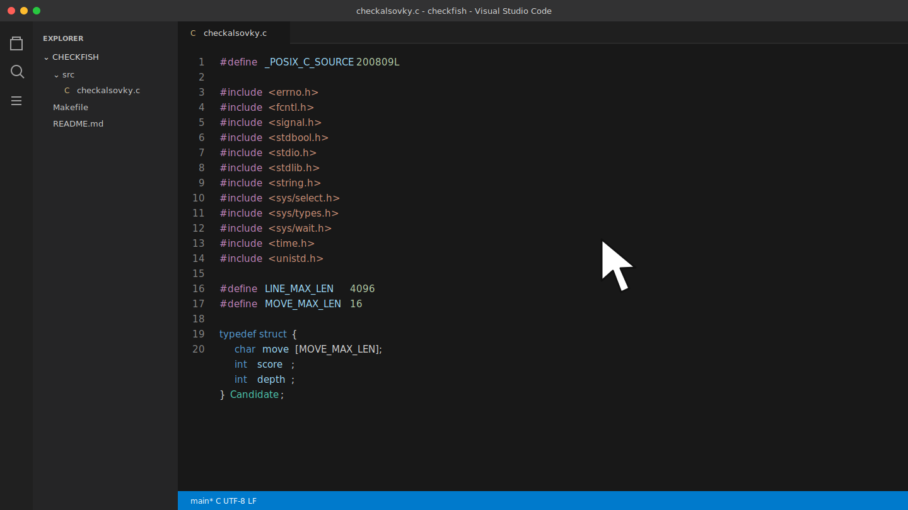
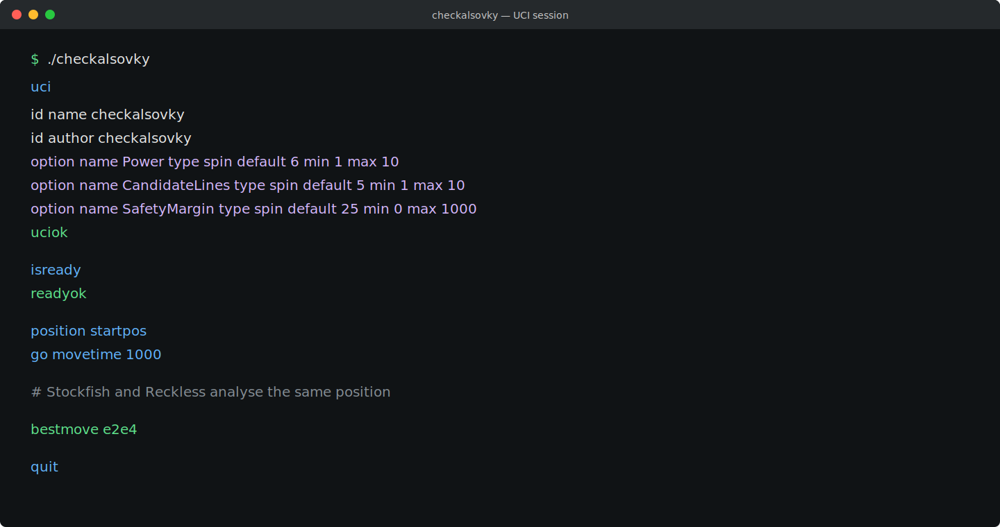

# checkalsovky

**One UCI identity. Two independent chess engines. One final move.**

`checkalsovky` is a compact C wrapper that coordinates Stockfish and Reckless behind a single Universal Chess Interface (UCI) process. It asks both engines to analyse the same position, compares their candidate moves, and emits one `bestmove` without exposing backend engine names in normal UCI output.



## How it works

```text
Chess GUI / UCI client
          |
          v
    checkalsovky
      /       \
 Stockfish   Reckless
      \       /
       move selection
          |
          v
       bestmove
```

Stockfish supplies MultiPV candidate lines. Reckless provides an independent preferred move. When Reckless's move is present in Stockfish's candidate set and remains inside the configured safety margin, the wrapper can select it; otherwise Stockfish's best move wins.

## Requirements

- A C11 compiler (`cc`, Clang, or GCC)
- GNU Make
- Git with submodule support
- Rust/Cargo for building Reckless
- macOS or Linux

Visual Studio Code is the recommended editor for this repository. The included build task runs `make` directly from VS Code.

## Build

Clone the repository and both engine submodules:

```bash
git clone --recurse-submodules https://github.com/Abd196-bit/checkalsovky.git
cd checkalsovky
make engines
```

For an existing clone without initialized submodules:

```bash
git submodule update --init --recursive
make engines
```

To rebuild only the C wrapper:

```bash
make
```

The resulting UCI executable is `./checkalsovky`.

## Quick start

Send standard UCI commands over stdin:

```bash
printf 'uci\nisready\nposition startpos\ngo movetime 1000\nquit\n' | ./checkalsovky
```



You can also register the absolute path to `checkalsovky` as a custom engine in any UCI-compatible chess GUI.

## Engine options

| Option | Default | Range | Purpose |
| --- | ---: | ---: | --- |
| `Power` | `6` | `1-10` | Multiplies requested `movetime` for deeper backend analysis. |
| `CandidateLines` | `5` | `1-10` | Sets Stockfish MultiPV candidate count. |
| `SafetyMargin` | `25` | `0-1000` | Maximum centipawn gap allowed when accepting the secondary move. |

Example:

```text
setoption name CandidateLines value 7
setoption name SafetyMargin value 40
```

## UCI identity

The wrapper deliberately presents one public identity:

```text
id name checkalsovky
id author checkalsovky
```

Backend engine names are not printed during normal UCI operation.

## Project layout

```text
.
|-- src/checkalsovky.c   # Process control, UCI parsing, and move selection
|-- Makefile             # Wrapper and backend builds
|-- .gitmodules          # Stockfish and Reckless dependencies
|-- .vscode/tasks.json   # Visual Studio Code build task
`-- assets/              # README previews
```

## Clean

```bash
make clean
```

## Notes

- The repository does not redistribute backend source directly; Git submodules pin their upstream projects.
- A `go` command without `movetime` currently uses a 30-second wrapper timeout.
- The checked-in executable, when present, may be platform-specific. Building from source is recommended.

